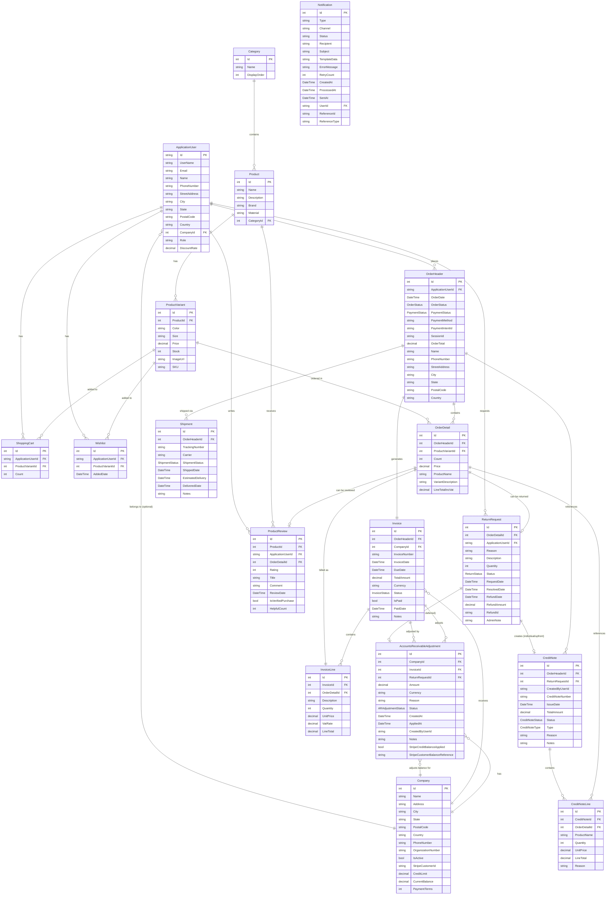
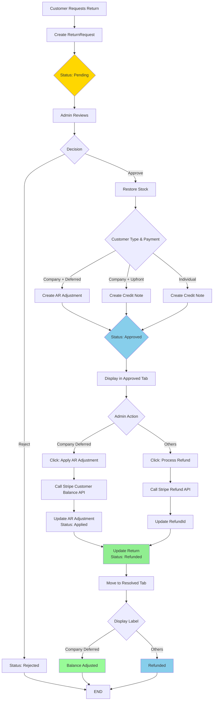
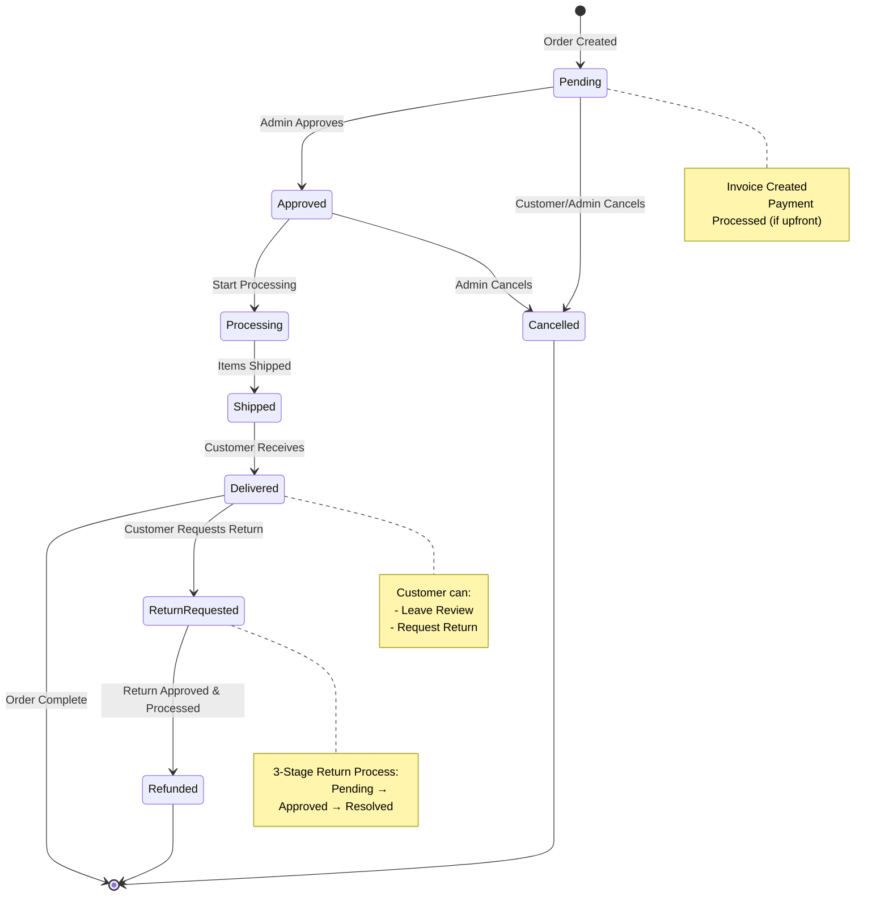
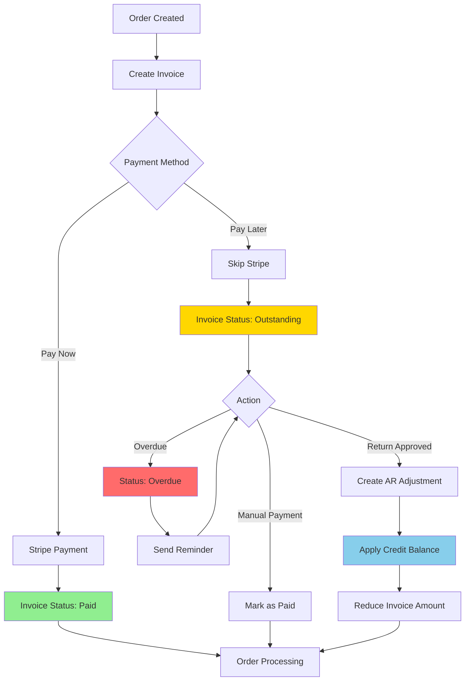
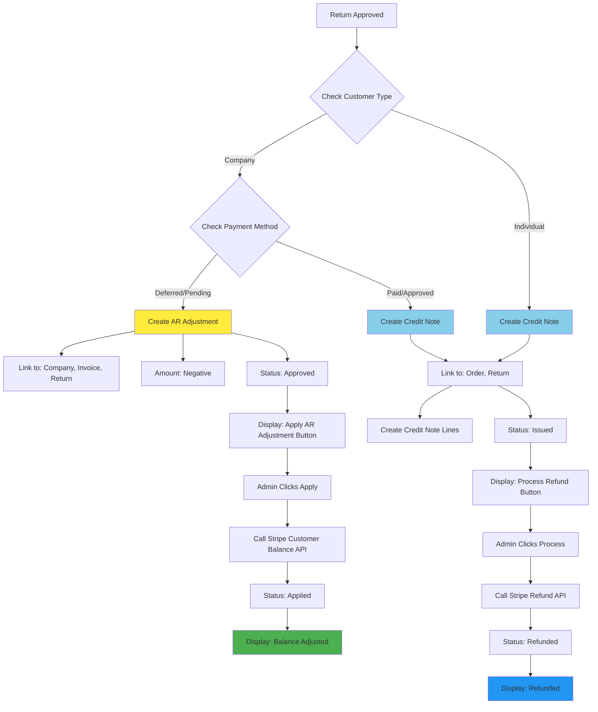
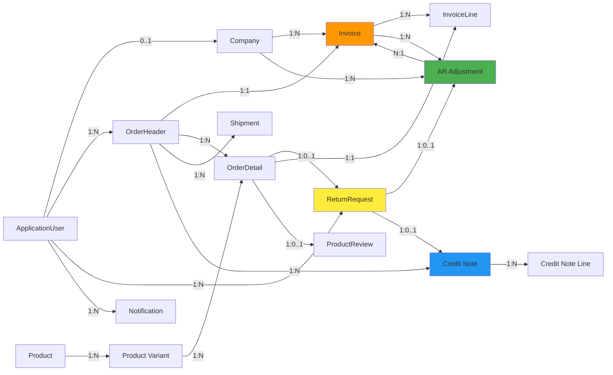

# 🎨 Cartiva ERD - Mermaid Diagrams

## 📊 **Complete Entity Relationship Diagram (Mermaid)**

---

## 🔄 **Return Management Flow (Mermaid)**

---

## 📊 **Order Lifecycle (Mermaid)**

---

## 🔄 **Invoice & Payment Flow (Mermaid)**

---

## 🎯 **AR Adjustment vs Credit Note Decision (Mermaid)**

---

## 📊 **Database Table Relationships (Simplified)**

---

## 🎯 **Key Takeaways**

### **Relationship Types**
- **1:1** (One-to-One): Order ↔ Invoice
- **1:N** (One-to-Many): Order → OrderDetail
- **N:1** (Many-to-One): OrderDetail → ProductVariant
- **0..1** (Optional): ReturnRequest → AR Adjustment

### **Critical Paths**
1. **Order Creation**: User → Order → Invoice → OrderDetail → InvoiceLine
2. **Return Flow**: OrderDetail → ReturnRequest → AR Adjustment OR Credit Note
3. **Company Flow**: Company → User → Order → Invoice → AR Adjustment

### **Exclusive Relationships**
- Return creates **EITHER** AR Adjustment **OR** Credit Note (never both)
- Determined by: Customer Type + Payment Method

---

**Version**: 5.0  
**Format**: Mermaid  
**Render**: Copy to Mermaid Live Editor or GitHub  
**Last Updated**: 2025  
